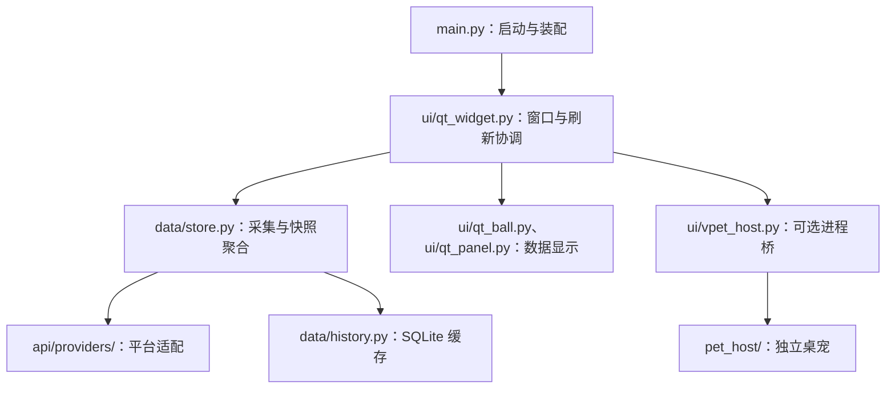

# 项目目录结构

先按三部分理解仓库：Python 主程序、可选的 .NET 桌宠、构建与维护资料。
日常修改主程序通常只需要查看 `main.py`、`api/`、`config/`、`core/`、`data/`、
`updater/` 和 `ui/`；桌宠源码及本地构建缓存不属于主程序的界面实现。

## 目录导航

```text
TokenMeter/
├── main.py              # 启动、单实例、配置初始化和应用装配
├── api/                 # 平台 API、Provider 和计价规则
├── config/              # 配置、凭据、迁移和运行时状态
├── core/                # 应用身份、Windows 自启和桌宠扩展安装管理
├── data/                # 数据目录、聚合和 SQLite 历史记录
├── updater/             # 更新检查、安装和独立更新器入口
├── ui/                  # PySide6 用户界面
├── pet_host/            # .NET / WPF 桌宠宿主和独立版本清单
├── third_party/VPet/    # 随仓库维护的 VPet 核心源码、来源和授权
├── packaging/           # PyInstaller、Inno Setup 和 Windows 版本资源
├── scripts/             # 构建与发布自动化
├── assets/              # 应用图标与不同尺寸的图标导出
├── docs/                # 项目结构说明和 README 图片
├── examples/            # 示例配置和隔离的桌宠预览入口
├── release-notes/       # 按版本维护的发布说明
├── tests/               # 单元测试、UI 测试和打包检查
└── .github/             # CI、主程序发布和桌宠发布工作流
```

根目录还保留项目说明、开发工具配置和三份依赖清单。

## 主程序从哪里读

下面是主要调用关系，数据结果沿调用链返回；不是完整的模块导入图。



`main.py` 先完成单实例检查、配置初始化、自启同步和更新清理，再装配 Qt 应用、
悬浮窗口与托盘。`FloatingWidget` 首先显示悬浮球，按需创建主面板与设置页；后台任务
使用捕获的配置调用 `TokenData.fetch()`，由 Provider 读取平台数据，再聚合、缓存并更新界面。

| 要修改的行为 | 先看这里 | 相关验证 |
| --- | --- | --- |
| 启动、单实例、托盘 | `main.py`、`core/autostart.py`、`ui/qt_tray.py` | `tests/test_main.py`、`tests/test_autostart.py`、`tests/test_qt_ui.py` |
| 平台接口、额度与用量解析 | `api/providers/`；DeepSeek 的底层请求另在 `api/deepseek.py`、`api/deepseek_official.py` | `tests/test_api.py`、`tests/test_providers.py`、`tests/test_nayuto.py` |
| 浏览器凭据获取 | `api/browser_cookie.py` 与对应 Provider | `tests/test_browser_cookie.py`、`tests/test_providers.py` |
| 刷新调度、切换平台、过期请求处理 | `ui/qt_widget.py` | `tests/test_refresh.py` |
| 数据聚合、离线快照、历史记录 | `data/store.py`、`data/history.py` | `tests/test_store.py`、`tests/test_history.py` |
| 悬浮球、主面板、图表 | `ui/qt_ball.py`、`ui/qt_panel.py`、`ui/qt_heatmap.py`、`ui/geometry.py` | `tests/test_qt_ui.py`、`tests/test_widget_heatmap.py`、`tests/test_geometry.py` |
| 设置、配置保存与数据迁移 | `ui/qt_settings.py`、`config/`、`data/directory.py` | `tests/test_config.py`、`tests/test_data_directory.py`、`tests/test_qt_ui.py` |
| 主题、语言与显示格式 | `ui/qt_theme.py`、`ui/i18n.py`、`ui/translations.py`、`ui/translation_errors.py`、`ui/formatting.py` | `tests/test_qt_theme.py`、`tests/test_i18n.py`、`tests/test_qt_ui.py` |
| 主程序更新 | `ui/qt_update.py`、`updater/client.py`、`updater/main.py` | `tests/test_update.py`、`tests/test_packaging.py`、`tests/test_installer.py` |

### 容易混淆的职责

- `config/runtime.py` 是应用使用的配置入口，协调初始化、路径、日志与状态；
  `defaults.py` 定义配置项，`store.py` 做校验和 JSON 保存，`credentials.py` 管理凭据，
  `migration.py` 处理旧配置，`state.py` 保存窗口及更新状态。不是七套配置实现。
- `data/store.py` 不只是存储：`TokenData` 同时承担数据模型、采集流程、聚合和快照恢复。
  SQLite 操作集中在 `data/history.py`；目录解析及迁移在 `data/directory.py`。
- `api/providers/` 是平台统一适配入口；`api/deepseek.py` 等是其复用的底层客户端，
  并非相互替代的两套接口。平台差异优先放入对应 Provider。
- `core/` 当前含应用基础信息及系统集成，`pet_extension.py` 还依赖配置和更新客户端；
  不能把整个目录视为不依赖业务的最底层，也不应继续当作通用杂物目录。
- `config/store.py` 复用了计价规则，`config/runtime.py` 复用了数据目录工具。
  包之间存在双向引用方向，但不等同于已发生循环导入故障；迁移文件时要核对具体模块。

## 桌宠是一条独立交付链

| 部分 | 所在位置 | 发布归属 |
| --- | --- | --- |
| 设置入口、安装/卸载与兼容性检查 | `ui/qt_settings.py`、`core/pet_extension.py`、`updater/client.py` | 主程序 |
| 子进程生命周期与展示字段协议 | `ui/vpet_host.py` | 主程序 |
| 桌宠窗口、交互、额度气泡 | `pet_host/` | 桌宠扩展 |
| VPet 核心及来源授权 | `third_party/VPet/` | 桌宠扩展 |
| 宿主编译与资源裁剪 | `scripts/build_vpet.py` | 构建工具 |
| 主安装器与独立桌宠 ZIP 打包 | `scripts/build_release.py`、`packaging/` | 构建工具 |

主程序版本定义在 `core/identity.py`；桌宠版本定义在 `pet_host/extension.json`。
主程序 `v*` Tag 使用 `.github/workflows/release.yml`；桌宠 `pet-v*` Tag 使用
`.github/workflows/pet-release.yml`，产物位于 `dist-pet/`，不进入主安装包。
主程序通过本机管道发送允许的展示字段，不向桌宠传递账户凭据。

桌宠统一使用 `VPetHost` 与独立宿主，旧精灵图实现及其角色资源已移除。

详细构建与发布边界见 [桌宠开发说明](../pet_host/README.md) 和
[VPet 源码维护说明](../third_party/VPet/UPSTREAM.md)。

## 导入与启动入口

原有的九个转发文件已移除，仓库内的业务代码与测试均直接导入实现模块。
外部脚本若仍使用旧路径，需要按下表迁移：

| 已删除的旧路径 | 使用的实现路径 |
| --- | --- |
| `app_identity.py` | `core/identity.py` |
| `app_update.py` | `updater/client.py` |
| `config_manager.py` | `config/runtime.py` |
| `data_directory.py` | `data/directory.py` |
| `deepseek_pricing.py` | `api/deepseek_pricing.py` |
| `updater_main.py` | `updater/main.py` |
| `ui/widget.py` | `ui/qt_widget.py` |
| `ui/settings.py` | `ui/qt_settings.py` |
| `ui/tray.py` | `ui/qt_tray.py` |

例如使用 `from config import runtime as config_manager`；这里的 `as` 只是调用方的局部命名，
不依赖转发文件。测试的字符串 mock 路径也应指向实际模块，如 `updater.client`、`data.directory`。

主程序继续通过 `python main.py` 启动；独立更新器从仓库根目录使用
`python -m updater.main`，参数保持不变，可用 `python -m updater.main --help` 查看。
PyInstaller 直接以 `updater/main.py` 为入口，并将仓库根目录加入模块搜索路径。

## 本地目录与正式源码分开看

`build/`、`dist/`、`dist-installer/`、`dist-pet/`、`dist-vpet-preview/`、`.venv*`、
`__pycache__/`、测试缓存和设计验收产物属于本地环境或生成内容，不纳入上面的源码结构。
以 `git ls-files` 查看正式维护范围，用 `git status --short` 区分未提交内容。
未跟踪目录并不一定可删除，可能含未提交工作或个人数据。

`build/vpet-upstream/` 是下载资源缓存；需要改核心逻辑时修改 `third_party/VPet/`，
不要修改缓存中的源码副本。也不要把代码包 `data/`、`config/` 当作缓存目录清理；
实际用户数据位置由 `config/runtime.py` 和 `data/directory.py` 解析。

## 后续精简顺序

1. 优先按现有组件边界拆出 `ui/qt_panel.py` 中的趋势图与分时图，保留 `MainPanel` 的装配职责。
2. 再梳理 `ui/qt_widget.py` 的刷新任务、请求状态及凭据续期，避免继续与窗口拖动、贴边逻辑混写。
3. 按独立流程整理 `ui/qt_settings.py` 的桌宠管理和 `data/store.py` 的采集/快照处理，保持现有输入输出。
4. 随受影响模块整理 `tests/test_qt_ui.py`，复用现有 fixture，不另造测试框架。
5. 已明确分工的小模块不以文件数为由合并，不再为已删除的导入路径增加转发层。

优先在现有目录内拆出有明确职责的模块；暂不引入统一 `src/` 迁移、通用服务层或新的插件框架。
搬移前需检查导入、测试替换路径、`Path(__file__)` 相对资源路径及打包配置。

## 常用命令与验证边界

```powershell
python main.py
python -m pytest -q
python -m ruff check .
python -m pyright
python scripts/build_release.py
python scripts/build_release.py --stage pet
```

运行、开发和构建依赖分别在 `requirements.txt`、`requirements-dev.txt`、
`requirements-build.txt` 中维护。`pytest.ini` 将测试收集限制到 `tests/`。
Ruff 与 Pyright 当前使用显式检查范围（`pyproject.toml`、`pyrightconfig.json`），
运行默认命令不代表所有业务文件都已被直接检查；模块拆分时应同步核对新路径是否纳入检查。
发布操作另遵守根目录的 `GIT_VERSION_AND_MERGE_RULES.md`。
